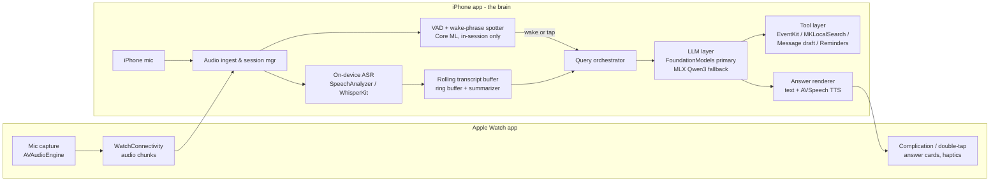

# Saturday — System Architecture (v0.1 draft)

*Draft written before research reports landed; numbers/API details to be reconciled
against `01–03` research docs.*

## High-level topology

## Components

### 1. Session manager
- Owns the listening session lifecycle: start (App Intent / Action Button / Watch),
  keep-alive (audio background mode so lock screen doesn't kill capture), interruption
  handling (calls, Siri), stop + summary generation.
- Session state machine: `idle → listening → querying → answering → listening → … → ended`.

### 2. Audio ingest
- iPhone mic path: `AVAudioEngine` tap, 16 kHz mono downstream.
- Watch mic path: Watch records and streams compressed chunks (Opus/AAC ~1–2 s) over
  `WatchConnectivity`; iPhone reassembles into the same pipeline. Latency budget and
  reliability strategy per research doc 02.

### 3. ASR layer (on-device only)
- Primary: iOS 26 `SpeechAnalyzer`/`SpeechTranscriber` (streaming, on-device).
- Fallback/quality: WhisperKit. Abstract behind `TranscriberProtocol` so engines swap.
- Emits timestamped utterances with speaker-change hints if available.

### 4. Rolling transcript buffer
- Ring buffer of recent utterances (target: last ~10–15 min verbatim).
- Older content is periodically **compacted by the LLM into running summary notes** so a
  1-hour meeting still fits the model's context window. Two tiers:
  `verbatim tail` + `compressed summary head`.
- Persisted locally (encrypted, Core Data/SQLite); retention policy user-configurable.

### 5. Wake-phrase + VAD (in-session only)
- VAD gates ASR compute when the room is silent.
- Keyword spotter listens for the wake phrase only while a session is active — small
  Core ML model; candidates and licensing in research doc 02.
- Alternate triggers: Watch tap/double-tap, phone button — wake phrase is convenience,
  not the only path.

### 6. LLM layer (hybrid)
- `LLMBackend` protocol with two implementations:
  - **AFMBackend** — FoundationModels framework: `LanguageModelSession` seeded with a
    system prompt + compressed context; `Tool` protocol for actions; `@Generable` for
    structured outputs (summary cards, action items).
  - **MLXBackend** — MLX Swift running a quantized open model (candidate: Qwen3-4B
    4-bit; final pick per research doc 01). Downloaded on demand (not bundled — keeps
    App Store binary small). Implements the same tool-calling contract via
    constrained JSON.
- Routing: AFM if available → else MLX; user-visible "quality mode" toggle later.

### 7. Tool layer
- `CalendarTool` (EventKit add event), `ReminderTool`, `PlacesTool` (MKLocalSearch —
  no API key, on-device-ish), `MessageDraftTool` (compose sheet — user taps send),
  `TimerTool`, later `ContactsTool`.
- Every tool is a pure Swift type conforming to both AFM's `Tool` and our own
  JSON-schema interface so both backends share one implementation.
- All tool executions are confirm-by-default in v1 (show the event/message before commit).

### 8. Answer surface
- iPhone: compact answer card over the session screen; TTS optional.
- Watch: short answer + haptic; long answers say "details on phone."
- AirPods: optional spoken answer with audio ducking (v1.1 candidate).

## Privacy architecture
- No networking in the inference path at all; app functions with network off
  (worth advertising: works in airplane mode).
- Mic indicator always visible (system-enforced); in-app persistent "listening" banner.
- Transcripts encrypted at rest; default auto-delete after N days; explicit
  export-only sharing.

## Performance budgets (targets, to validate in M1)
| Path | Budget |
|---|---|
| Wake phrase → mic ready (phone) | < 300 ms |
| Watch tap → phone session start | < 1.5 s |
| Question end → first answer token | < 2.5 s |
| ASR lag behind speech | < 2 s |
| Battery, 1-hour session (phone) | < 15% |
