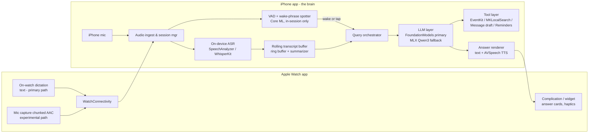

# Saturday — System Architecture (v0.2)

*Reconciled against research docs `01–03` (2026-08-01).*

## High-level topology

## Components

### 1. Session manager
- Owns the listening session lifecycle: start (App Intent / Action Button / Watch),
  keep-alive (audio background mode so lock screen doesn't kill capture), interruption
  handling (calls, Siri), stop + summary generation.
- **Recording must start in the foreground** (iOS rule); one `StartListeningIntent`
  (`openAppWhenRun = true`) backs every activation surface. Live Activity in the Dynamic
  Island doubles as the guideline-2.5.14 "clear visual indication."
- **Interruption rule (hard iOS constraint):** after a call/Siri interruption, a
  backgrounded app cannot reactivate the mic. On interruption-end while backgrounded,
  post a local notification — "tap to resume Saturday" — and resume on tap.
- Session state machine: `idle → listening → querying → answering → listening → … →
  interrupted → ended`.

### 2. Audio ingest
- iPhone mic path: `AVAudioEngine` tap, 16 kHz mono downstream. **The iPhone is the
  session recorder** — ambient capture happens on the phone, not the watch.
- Watch input, two paths (research docs 01–02):
  - **Primary (robust): on-watch dictation → text** via `sendMessage`. Watch queries are
    short; dictation is on-device on S9+; payload is tiny.
  - **Experimental (fidelity): chunked compressed audio** (AAC, 5–15 s chunks) via
    `sendMessageData`/`transferFile` → phone-side ASR. Expect 5–30 s lag and reachability
    flaps; validate in M0 Spike C before committing.

### 3. ASR layer (on-device only)
- Primary: iOS 26 `SpeechAnalyzer`/`SpeechTranscriber` (streaming, on-device, system-owned
  models = zero app RAM, `ko_KR` supported; VAD via bundled `SpeechDetector`).
  **Not available on watchOS** — another reason the phone transcribes.
- Fallback/quality: WhisperKit (0.46 s streaming latency; only needed pre-iOS-26).
  Abstract behind `TranscriberProtocol` so engines swap.
- Emits timestamped utterances with speaker-change hints if available.

### 4. Rolling transcript buffer
- Ring buffer of recent utterances. Sizing is driven by a hard constraint: Foundation
  Models has a **fixed 4,096-token context (input + output)** — so the verbatim tail is
  roughly the last ~2–3 min of dense speech, and everything older must be compacted.
- Older content is periodically **compacted by the LLM into running summary notes** so a
  1-hour meeting still fits. Two tiers: `verbatim tail` + `compressed summary head`;
  rebuild the session with condensed history on `.exceededContextWindowSize`
  (Apple's TN3193 pattern). Run compaction in short bursts (thermal throttling — doc 01).
- Persisted locally (encrypted, Core Data/SQLite); retention policy user-configurable.

### 5. Wake-phrase + VAD (in-session only)
- VAD gates ASR compute when the room is silent (`SpeechDetector` or Silero VAD Core ML).
- Wake phrase works only while a session is active (no system-wide wake word exists for
  3rd parties). v1 approach: **hotphrase detection on the live transcript** ("Saturday,
  …") — zero extra model, works in any ASR language. Dedicated KWS model (openWakeWord →
  Core ML) only if transcript-hotphrase latency/accuracy disappoints; Porcupine is
  ~$6k/yr — skip.
- Alternate triggers: Watch tap, phone button — wake phrase is convenience, not the only
  path. (Watch Double Tap has no 3rd-party API; Ultra Action button only via Shortcuts.)

### 6. LLM layer (hybrid)
- `LLMBackend` protocol with two implementations (mirrors iOS 27's upcoming
  `LanguageModel` provider protocol — migrate to it when it ships):
  - **AFMBackend** — FoundationModels framework: `LanguageModelSession` seeded with a
    system prompt + compressed context; `Tool` protocol for actions; `@Generable` for
    structured outputs (summary cards, action items). Free, zero app RAM, `ko` supported.
    Check `SystemLanguageModel.default.availability`; handle guardrail refusals.
  - **MLXBackend** — MLX Swift running a quantized open model. Candidates per doc 01:
    **Qwen3-4B 4-bit** (~2.3 GB, 8 GB devices) / **Qwen3-1.7B** (~1 GB, 6 GB devices);
    HyperCLOVA X SEED for the Korean pack. EXAONE/Kanana excluded (non-commercial
    licenses). Downloaded on demand via Background Assets (not bundled). Same
    tool-calling contract via constrained JSON. Respect the ~4 GB jetsam ceiling.
- Routing: AFM if available → else MLX; user-visible "quality mode" toggle later.

### 7. Tool layer
- `CalendarTool` (EventKit add event), `ReminderTool`, `PlacesTool` (MKLocalSearch —
  no API key, no billing), `MessageDraftTool` (compose sheet — user taps send; MessageUI
  doesn't exist on watchOS, so watch-initiated drafts hand off to the phone),
  `TimerTool`, later `ContactsTool`.
- **Permission ladder** (doc 03): event *add* needs zero permission via
  `EKEventEditViewController` (iOS 17+ out-of-process sheet) — use as default;
  write-only calendar access for silent adds; full access only when the user wants
  "what's on my calendar" reads. Reminders require full reminders access (no write-only
  tier exists).
- Every tool is a pure Swift type conforming to both AFM's `Tool` and our own
  JSON-schema interface so both backends share one implementation.
- All tool executions are confirm-by-default in v1 (show the event/message before commit).

### 8. Answer surface
- iPhone: compact answer card over the session screen; TTS optional.
- Watch: short answer + haptic; long answers say "details on phone."
- AirPods: optional spoken answer with audio ducking (v1.1 candidate).

## Privacy architecture
- No networking in the inference path at all; app functions with network off
  (worth advertising: works in airplane mode).
- Mic indicator always visible (system-enforced); in-app persistent "listening" banner.
- Transcripts encrypted at rest; default auto-delete after N days; explicit
  export-only sharing.

## Performance budgets (targets, to validate in M1)
| Path | Budget |
|---|---|
| Wake phrase → mic ready (phone) | < 300 ms |
| Watch tap → phone session start | < 1.5 s |
| Question end → first answer token | < 2.5 s |
| ASR lag behind speech | < 2 s |
| Battery, 1-hour session (phone) | < 15% |
